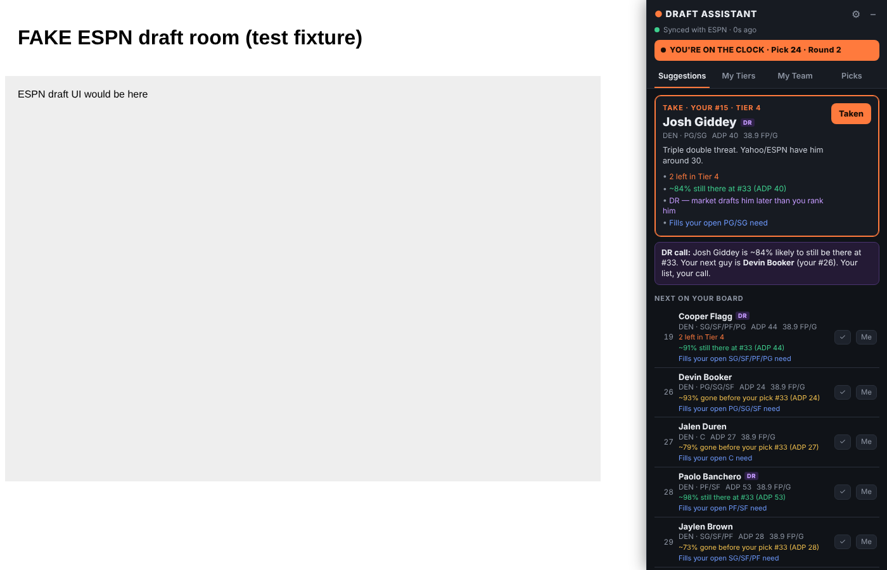

# Hoops Draft Assistant

Your own fantasy basketball tier list, live inside the ESPN draft room. It works like the FantasyPros Draft Assistant panel, but your list drives every suggestion.



- **Your order is law.** The top suggestion is always the highest-ranked player on *your* board who's still available. Nothing reorders your list.
- **Syncs with ESPN automatically.** Works in mock and real drafts. It reads picks, teams, draft order, roster slots and scoring from ESPN's own draft-room requests (with your existing ESPN login) every ~3 seconds. Drafted players get crossed off and your picks go to My Team.
- **Your spreadsheet is built in.** *Fantasy Basketball Ranking 8* has 168 players across 12 tiers. `*` = injury prone, `DR` = don't reach (the market drafts him later, but you like him there). Tiers and notes come from your tier sheet.
- **Context, not overrides.** Each player shows notes for the last player left in a tier, the chance he's gone before your next pick (from ESPN ADP), open-slot needs, and ESPN injury status. For a DR player who'll probably still be there next turn, the panel tells you so and names the next player on your list. The decision stays yours.

## Install (2 minutes, Chrome / Edge / Brave)

1. Download this repo (Code → Download ZIP) and unzip it.
2. Open `chrome://extensions` and turn on **Developer mode** (top right).
3. Click **Load unpacked** and pick the `extension/` folder.
4. Open any ESPN fantasy **basketball** draft room. The panel docks on the right.
   - **Alt+Shift+D** hides or shows it.
   - ⚙ opens rankings & settings.

To practice, start an ESPN mock draft (fantasy.espn.com → Basketball → Mock Draft Lobby) and watch the panel follow along.

## Panel tabs

| Tab | What it does |
| --- | --- |
| **Suggestions** | Who to take now (your top available player), the DR call, your next 5, and who's probably still there at your next pick |
| **My Tiers** | Your full board by tier with drafted players crossed off, your picks in blue, and a "left in tier" meter. Fully drafted tiers fold away. Type a name and press Enter to mark him drafted. |
| **My Team** | Your roster, which starting slots are still empty, position counts, and projected FP/G in your scoring |
| **Picks** | Every pick so far with team names. Undo and "Me" fix-ups. |

## If ESPN sync doesn't work

The header shows the sync state, and the panel falls back in this order:

1. **ESPN API** (green): exact picks.
2. **Reading the page** (yellow): if ESPN won't serve the league data (some mock rooms, outages), it reads drafted names from the page's pick and roster widgets. This is best effort, because ESPN can change its page.
3. **Manual**: ✓ marks a player drafted, **Me** marks him yours, and Enter in the search box marks the first match. The popup also opens a full-page **manual draft board** for Yahoo, Sleeper or in-person drafts.

## Changing your rankings

⚙ → *Import or replace your list*. You can paste straight from Excel or Google Sheets (name column, plus the DR column), a CSV, or text with `Tier N` lines. If the pasted list has no tiers, your current tier breaks are kept by rank position. **Restore my spreadsheet board** brings back Ranking 8. The editable source is [`data/omar-rankings.csv`](data/omar-rankings.csv).

## ESPN's pre-draft rankings (autopick)

The extension **only reads** from ESPN. It doesn't edit ESPN's pre-draft list, because ESPN has no published API for that and changing your league data behind your back isn't safe. If you want autopick to follow your board, use ⚙ → **Copy as text** and drag the first few rounds into place in ESPN's *Pre-Draft Rankings* editor.

## Development

```
extension/
  core/      pure logic (no DOM): names, rankings parser, scoring, ESPN parsers, draft engine, page scan
  data/      default-rankings.js (generated from data/omar-rankings.csv)
  ui/app.js  panel controller + renderer (shadow DOM)
  content/   ESPN draft-room bootstrap + sync loop
  options/ popup/ standalone/
tests/       node:test unit tests + Playwright e2e against a fake ESPN draft room
```

- `npm test`: unit tests for parsing, matching, snake math, roster matching, availability model, suggestions, ESPN response parsing, and the default board order.
- `NODE_PATH=$(npm root -g) node tests/e2e/espn-draft-room.e2e.js`: loads the real extension in Chromium against a mocked ESPN draft room and API.

**Known limits.** ESPN's read API is undocumented, so the parsers are defensive and the panel degrades instead of breaking. Page-reading has only been tested against the mock page, not ESPN's real markup. Availability percentages are estimates from a normal spread around ESPN ADP.
